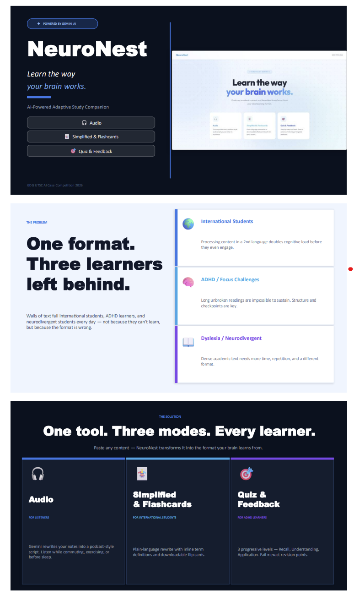

# NeuroNest 🧠
### AI-Powered Adaptive Learning Companion

> Transforms any academic content into the format your brain learns best — audio, flashcards, or progressive quizzes.

🔗 **[Live Demo → shanlight-ctrl.github.io/NeuroNest](https://shanlight-ctrl.github.io/NeuroNest)**



---

## The Problem

The standard way of studying — walls of text, long readings, passive review — is built for one type of learner. But many university students don't fit that mould:

- **International students** process content in a second language, doubling cognitive load
- **Students with ADHD** struggle to sustain focus through long unbroken material
- **Students with dyslexia or autism** process text differently, requiring more time and repetition

## Features

| Mode | What it does |
|------|-------------|
| 🎧 **Audio** | Converts notes into Normal or Podcast-style scripts — listen in-browser or download as MP3 |
| 🃏 **Simplified & Flashcards** | Plain-language rewrite, step-by-step explanations, or downloadable flashcard sheets |
| 🎯 **Quiz & Feedback** | 3 progressive levels — pass to advance, fail and get targeted revision feedback |

## Tech Stack

| Layer | Technology |
|-------|-----------|
| Frontend | HTML, CSS, Vanilla JS |
| Backend | Python, FastAPI |
| AI | Google Gemini 2.5 Flash |
| TTS | gTTS (Google Text-to-Speech) |
| Deployment | GitHub Pages + Render |

## Project Structure

```
NeuroNest/
├── index.html              ← Frontend UI
├── style.css               ← Styles
├── app.js                  ← Frontend logic
├── config.example.js       ← Backend URL template
├── backend/                ← FastAPI server
│   ├── main.py             ← API endpoints
│   ├── requirements.txt
│   ├── Dockerfile
│   └── .env.example
└── README.md
```

## Run Locally

### Backend
```bash
cd backend
pip install -r requirements.txt
cp .env.example .env        # add your GEMINI_KEY
python -m uvicorn main:app --reload
```

### Frontend
```bash
cp config.example.js config.js   # set BACKEND_URL to http://localhost:8000
# open index.html in your browser
```

Get a free Gemini key at [aistudio.google.com](https://aistudio.google.com).

## Deploy

- **Frontend** → GitHub Pages (root of `main` branch)
- **Backend** → Render (root directory: `backend`, add `GEMINI_KEY` env var)

---

*Built for GDG UTSC AI Case Competition 2026 — by a solo international student with ADHD, for students like me.*
